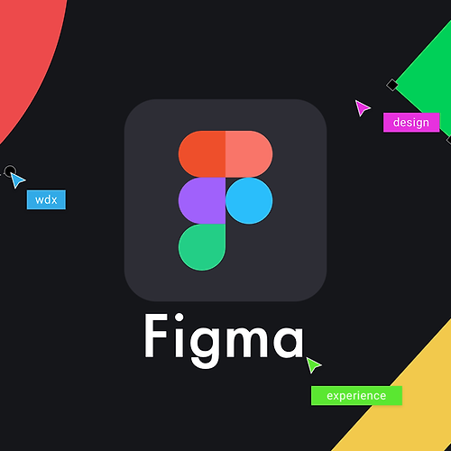

# 랜딩 페이지 프로젝트

## 1. 프로젝트 소개

이 프로젝트는 피그마 디자인을 참고하여 구현된 웹페이지입니다. 총 2가지의 프로젝트가 있습니다. 하나는 일반 웹 화면용이며, 다른 하나는 모바일 화면을 고려한 프로젝트입니다. 각 프로젝트는 HTML, CSS, JavaScript를 사용하여 구현되었습니다.

## 2. 개발 기간
- **PC 버전 개발**: 2024년 8월 19일 - 2024년 8월 23일
- **모바일 버전 개발**: 2024년 8월 26일 - 2024년 8월 27일
- **최종 수정 및 문서화**: 2024년 8월 28일

## 3. 개발 환경 및 배포 URL

- **개발 도구**: Visual Studio Code
- **언어**: HTML, CSS, JavaScript
- **버전 관리**: Git
- **기타**: 피그마(Figma)를 참고하여 디자인 구현

- **배포 URL**: https://zeonzyeon.github.io/FE-Project/

## 4. 사용 기술

- HTML: 페이지의 구조 및 콘텐츠를 정의합니다.
- CSS: 페이지의 스타일링과 레이아웃을 담당합니다.
- JavaScript: 페이지의 동적 동작을 구현합니다. 스크롤 이벤트, 모달창 동작, 이메일 유효성 검사 등의 기능을 처리합니다.

## 5. 요구사항
1. **피그마를 참고하여 페이지 구현을 합니다.**
2. **모바일 화면도 고려하여 페이지 구현을 합니다.**
3. **스크롤 시 헤더가 고정되게 합니다.** 
   - 처음에는 고정된 상태가 아닙니다.
4. **스크롤 탑 버튼을 구현합니다.**
   - 스크롤 시 나타납니다.
   - 푸터 아래로 내려가지 않습니다.
   - 버튼을 누르면 스크롤이 최상단으로 부드럽게 올라갑니다.
5. **구독하기 모달창을 구현합니다.**
   - 이메일을 입력하고 `Subscribe` 버튼을 클릭하면 모달창이 나타납니다.
   - 이메일 유효성 검사를 합니다. (값이 들어가지 않거나 이메일 형식이 유효하지 않으면 alert 창으로 경고 문구가 표시됩니다.)
   - 이메일이 잘 입력되었다면 모달창이 나타납니다. 모달창의 `OK! I love HODU` 버튼을 클릭하면 form이 제출되고 모달창이 닫힙니다.

## 6. 개발 화면
### PC 버전
header, main|section|
---|---|
|

section|aside|
---|---|
|

footer|modal|
---|---|
|

### Mobile 버전
header, main|nav|section|
---|---|---|
||

aside|footer|modal|
---|---|---|
||

## 6. 주요 기능
- 스크롤 이벤트
- 이메일 유효성 검사
- 모달창 동작

## 7. 개발하며 느낀점
이번 프로젝트를 통해 다음과 같은 점을 배웠습니다.

